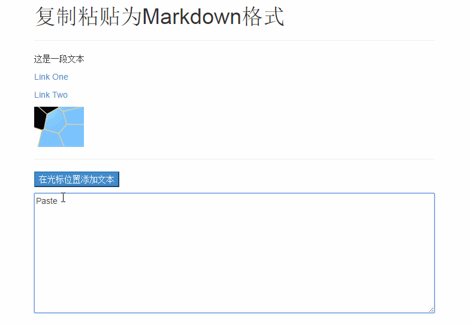

# Paste as Markdown
类似简书Markdown编辑器，粘贴链接时自动转换为MarkDown格式。

仅在Chrome 51做了测试。欢迎来完善代码。

## 参考

[JavaScript get clipboard data on paste event (Cross browser)](http://stackoverflow.com/questions/2176861/javascript-get-clipboard-data-on-paste-event-cross-browser)

[Insert text into textarea at cursor position (Javascript)](http://stackoverflow.com/questions/11076975/insert-text-into-textarea-at-cursor-position-javascript)

## 其他
来自[@district10](https://github.com/district10)的提醒：
https://github.com/euangoddard/clipboard2markdown 提供了类似的能力。
